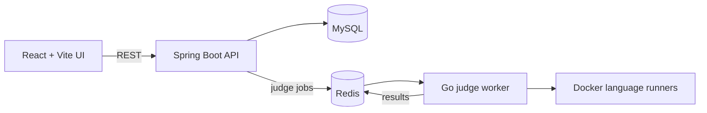

# CodeForge

CodeForge is a full-stack coding practice and assessment platform for students,
faculty, and external participants. It combines a responsive React workspace
with timed assessments, problem authoring, submission evaluation, and faculty
result analysis.

## Product highlights

- LeetCode-style workspace with Monaco Editor, resizable panels, custom input,
  theme controls, and C++, Java, and Python support.
- Per-problem and per-language code persistence, isolated between practice and
  live-test sessions.
- Searchable and filterable practice library with difficulty and category
  discovery.
- Timed, full-screen assessment flow with identity verification, expiry
  handling, submission status, and automatic completion.
- Faculty workflows for creating tests, authoring rich problems, attaching test
  cases, managing participants, and reviewing result dashboards.
- Sandboxed code execution through a Go judge service and language-specific
  Docker runners.

## Architecture



The frontend owns product interactions and local editor state. Spring Boot
manages problems, tests, participants, and submissions. Redis decouples the API
from the Go worker, which executes untrusted code in network-disabled,
resource-limited containers.

## Technology

| Layer | Stack |
| --- | --- |
| Frontend | React 19, JavaScript, Vite, Tailwind CSS, React Router, Monaco Editor |
| API | Java 21, Spring Boot, Spring Data JPA |
| Judge | Go, Redis, Docker |
| Data | MySQL, Redis |

## Local setup

Prerequisites: Java 21, Maven, Go, Node.js, npm, and Docker.

```bash
git clone git@github.com:Aditya01237/CodeForge.git
cd CodeForge
make setup
make start
```

Open `http://localhost:5173`. The API runs on `http://localhost:8080`, and the
judge health endpoint runs on `http://localhost:8081/health`.

For frontend-only development:

```bash
cd algojudge
cp .env.example .env
npm install
npm run dev
```

Set `VITE_API_ORIGIN` when the Spring Boot API is hosted somewhere other than
`http://localhost:8080`. Backend database and Redis settings can be overridden
with `DB_URL`, `DB_USERNAME`, `DB_PASSWORD`, `REDIS_HOST`, and `REDIS_PORT`.

## Quality checks

```bash
cd algojudge
npm run check

cd ../judge-service
go test ./...

cd ../codeforge
./mvnw -DskipTests package
```

`npm run check` runs ESLint, focused unit tests for problem filtering and editor
storage isolation, and the production Vite build.

## Core flows

1. A student searches the practice library and opens a problem.
2. CodeForge restores code for the selected problem and language.
3. Run evaluates custom or sample input; Submit evaluates stored test cases.
4. During assessments, participant identity, time limits, full-screen state,
   and completion state are enforced across the workflow.
5. Faculty can inspect participant-level and problem-level outcomes from the
   result dashboard.

## Repository layout

```text
algojudge/      React frontend
codeforge/      Spring Boot API
judge-service/  Go judge and Redis worker
docker/         Language runner images
```
