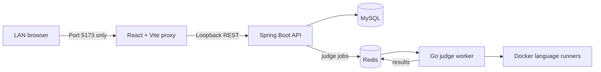

# CodeForge

CodeForge is a full-stack coding practice and assessment platform for students,
faculty, and external participants. It combines a responsive React workspace
with timed assessments, problem authoring, submission evaluation, and faculty
result analysis.

## Product highlights

- LeetCode-style workspace with Monaco Editor, resizable panels, custom input,
  theme controls, and C++, Java, and Python support.
- Per-problem and per-language code persistence, isolated between practice and
  live-test sessions.
- Searchable and filterable practice library with difficulty and category
  discovery.
- Timed, full-screen assessment flow with identity verification, expiry
  handling, submission status, and automatic completion.
- Faculty workflows for creating tests, authoring rich problems, attaching test
  cases, managing participants, and reviewing result dashboards.
- Live contest rankings that refresh automatically for students and faculty,
  with score, solved count, and deterministic tie-breaking.
- One-on-one interview rooms with a shared editor, live code synchronization,
  sample execution, meeting links, timers, and structured feedback.
- Sandboxed code execution through a Go judge service and language-specific
  Docker runners.

## Architecture



The frontend owns product interactions and local editor state. Spring Boot
manages problems, tests, participants, and submissions. Redis decouples the API
from the Go worker, which executes untrusted code in network-disabled,
resource-limited containers.

## Technology

| Layer | Stack |
| --- | --- |
| Frontend | React 19, JavaScript, Vite, Tailwind CSS, React Router, Monaco Editor |
| API | Java 21, Spring Boot, Spring Data JPA |
| Judge | Go, Redis, Docker |
| Data | MySQL, Redis |

## Local setup

Prerequisites: Java 21, Maven, Go, Node.js, npm, and Docker.

```bash
git clone git@github.com:Aditya01237/CodeForge.git
cd CodeForge
make setup
make start
```

Open `http://localhost:5173`. Vite proxies `/api` and `/uploads` to the Spring
API. The API, judge, MySQL, and Redis bind to `127.0.0.1`; only the frontend is
available to other devices on the LAN.

For frontend-only development:

```bash
cd algojudge
cp .env.example .env
npm install
npm run dev
```

Set `VITE_API_ORIGIN` only when intentionally using a separately hosted API.
Backend database and Redis settings can be overridden
with `DB_URL`, `DB_USERNAME`, `DB_PASSWORD`, `REDIS_HOST`, and `REDIS_PORT`.
Local database and Redis passwords live in the git-ignored `.env.local` file.
On first startup, CodeForge seeds a judge-ready practice library with sample and
hidden cases. Set `SEED_PROBLEM_LIBRARY=false` only when a deployment needs a
fully administrator-managed catalog.

For same-Wi-Fi testing, share `http://<your-wifi-ip>:5173`. Do not publish ports
`8080`, `8081`, `3307`, or `6379`; they are internal services. Test passwords
are stored as BCrypt hashes and are never returned by the API.

## Quality checks

```bash
cd algojudge
npm run check

cd ../judge-service
go test ./...

cd ../codeforge
./mvnw test
```

`npm run check` runs ESLint, focused unit tests for problem filtering and editor
storage isolation, and the production Vite build.

## Included DSA library

The starter catalog contains 15 runnable problems covering basic programming,
arrays, strings, stacks, binary search, dynamic programming, graphs, and two
pointers. Every problem includes a sample case for practice and hidden cases
for submission judging. The seeder is idempotent, so restarting the API updates
the curated metadata without duplicating the library.

## Core flows

1. A student searches the practice library and opens a problem.
2. CodeForge restores code for the selected problem and language.
3. Run evaluates custom or sample input; Submit evaluates stored test cases.
4. During assessments, participant identity, time limits, full-screen state,
   and completion state are enforced across the workflow.
5. Faculty can inspect participant-level and problem-level outcomes from the
   result dashboard.

## Live ranking and interview practice

- Students can open `/test/{testId}/leaderboard` during an assessment.
- Faculty can open `/faculty/tests/{testId}/live` for live standings.
- Rankings refresh every five seconds and use best score per problem, solved
  count, and earliest latest submission as tie-breakers.
- Interviewers create rooms from `/interview` and share the six-character room
  code. Problem and duration are chosen inside the room after participants join
  and before the interview starts.
- Candidates join the same interview room and collaborate in a shared Monaco
  editor. Code changes are synchronized through the API, while the existing
  judge evaluates sample cases.
- Interviewers can end the session and save a rating, strengths, and areas for
  improvement for the candidate.

## Repository layout

```text
algojudge/      React frontend
codeforge/      Spring Boot API
judge-service/  Go judge and Redis worker
docker/         Language runner images
```
